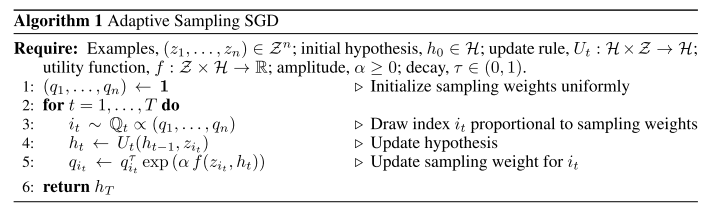

# PAC-Adasampling
An implementation of the algorithm proposed in 'A PAC-Bayesian Analysis of Randomized Learning with Application to Stochastic Gradient Descent', Ben London (NIPS 2017)

A faster way for your neural nets to converge. Based on a PAC-Bayesian analysis of generalization bounds.

From the paper at (https://arxiv.org/abs/1709.06617)
